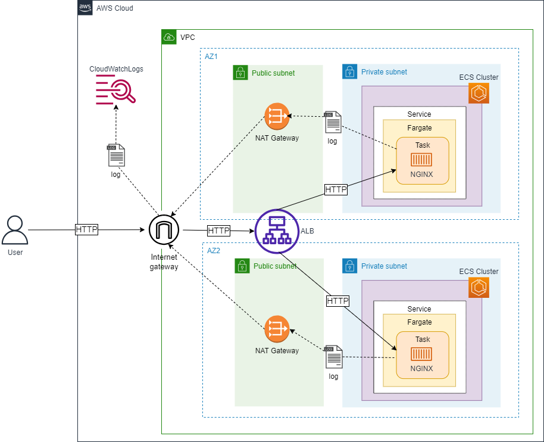

# Terraform勉強-第27回：ECS on FargateでのNGINXデプロイとCloudWatchログ監視

### 作成した全てのコード
githubリポジトリ："https://github.com/shu130/terraform-study27"

## ディレクトリ

ルートの `main.tf` で各モジュール（`nw`、`ecs`、`alb`、`cloudwatch`）を呼び出す

```
.
├── provider.tf       
├── main.tf            #=> モジュール呼び出し
├── variables.tf       #=> モジュール呼び出しで使用する変数の定義
├── outputs.tf         #=> モジュール側アウトプット(ID、ARN、DNS名など)を参照する役割
├── terraform.tfvars   #=> 変数の具体値(git管理外)
├── modules          
│   ├── nw
│   │   └── vpc.tf                
│   │   └── igw.tf                
│   │   └── natgw.tf              
│   │   └── private_subnets.tf    
│   │   └── public_subnets.tf     
│   │   └── variables.tf          
│   │   └── outputs.tf   #=> モジュールを呼び出すルート側に参照させる役割
│   ├── ecs           
│   │   └── main.tf               
│   │   └── iam.tf                
│   │   └── sg.tf                 
│   │   └── variables.tf          
│   │   └── outputs.tf   #=> モジュールを呼び出すルート側に参照させる役割
│   ├── lb            
│   │   └── main.tf               
│   │   └── sg.tf                 
│   │   └── variables.tf          
│   │   └── outputs.tf   #=> モジュールを呼び出すルート側に参照させる役割
│   └── cloudwatch    
│       └── main.tf               
│       └── variables.tf         
│       └── outputs.tf           
```

## 構成図


### プロバイダなど

- AWSプロバイダ/Terraformバージョン
- プロファイル
- リージョン
- デフォルトタグ

```hcl:./provider.tf
# ./provider.tf

terraform {
  required_version = ">= 1.6.2, < 2.0"
  required_providers {
    aws = {
      source  = "hashicorp/aws"
      version = ">= 5.4.0"
    }
  }
}

provider "aws" {
  profile = var.profile
  region = var.region

  default_tags {
    tags = {
      "ManagedBy" = "Terraform"
      "Project"   = var.app_name
    }
  }
}
```

#### 変数定義：

```hcl:./variables.tf
# variables.tf

#-------------------------------
# provider, etc

variable "profile" {
  type    = string
  default = "default"
}

variable "region" {
  type = string
}

variable "app_name" {
  type = string
}
```

#### 変数の具体値：

```hcl:./terrafrom.tfvars
# ./terraform.tfvars

#-------------------------------
# provider, etc

profile  = "example-user"
region   = "us-west-2"
app_name = "nginx-app"
```

## 1. VPC

NWモジュール側で、VPCのみ作成：

```hcl:./modules/nw/vpc.tf
# ./modules/nw/vpc.tf

resource "aws_vpc" "this" {
  cidr_block = var.vpc.cidr

  tags = {
    Name = "${var.app_name}-vpc"
  }
}
```

NWモジュール側で変数定義：

```hcl:./modules/nw/variables.tf
# ./modules/nw/variables.tf

variable "vpc" {
  type = object({
    cidr = string
  })
}

variable "app_name" {
  type = string
}
```

NWモジュール側でアウトプット定義：

```hcl:./modules/nw/outputs.tf
# ./modules/nw/outputs.tf

output "vpc_id" {
  value = aws_vpc.this.id
}
```

ルート側で呼び出し：

```hcl:./main.tf
# main.tf

module "network" {
  source = "./modules/nw"
  app_name = var.app_name
  vpc      = var.vpc
}
```

ルート側で変数定義：

```hcl:./variables
#-------------------------------
# nw
variable "vpc" {
  type = object({
    cidr = string
  })
}
```

ルート側で変数の具体値：

```hcl:
# ./terraform.tfvars

#-------------------------------
# provider, etc

(省略)

#-------------------------------
# nw
vpc = {
  cidr = "10.0.0.0/16"
}
```

## 2. private/publicサブネット

NWモジュール側で`count関数`を使い、まずはサブネットのみ作成  
NATGW, IGWを作成したあとにルートテーブルを追加する

```hcl:./modules/nw/private_subnets.tf
# ./modules/nw/private_subnets.tf

resource "aws_subnet" "privates" {
  count      = length(var.private_subnets)
  vpc_id     = aws_vpc.this.id
  cidr_block = var.private_subnets[count.index].private_subnet_cidr
  availability_zone = var.private_subnets[count.index].availability_zone
  
  tags = {
    Name = "${var.app_name}-private-${count.index}"
  }
}
```

```hcl:./modules/nw/public_subnets.tf
# ./modules/nw/public_subnets.tf

※プライベートサブネットと同様
```

### NATゲートウェイ

NWモジュール側でNATGWと固定IP作成：

```hcl:./modules/nw/natgw.tf
# ./modules/nw/natgw.tf

resource "aws_nat_gateway" "natgws" {
  count         = length(var.public_subnets)
  allocation_id = aws_eip.nat_eip[count.index].id    #=>EIPを割り当て
  subnet_id     = aws_subnet.publics[count.index].id #=>パブリックサブネットに配置

  tags = {
    Name = "${var.app_name}-ngw-${count.index}"
  }
}

resource "aws_eip" "nat_eip" {
  count  = length(var.public_subnets)
  domain = "vpc"                      #=> EIPをVPC内に割り当てる指定

  tags = {
    Name = "${var.app_name}-nat_eip-${count.index}"
  }
}
```

### インターネットGW

NWモジュール側でIGW作成：

```hcl:./modules/nw/igw.tf
# ./modules/nw/igw.tf

resource "aws_internet_gateway" "igw" {
  vpc_id = aws_vpc.this.id

  tags = {
    Name = "${var.app_name}-igw"
  }
}
```

### ルートテーブル

NWモジュール側のプライベートサブネットにNATGW宛ルート追加(`#=>`)：

```hcl:./modules/nw/private_subnets.tf
# ./modules/nw/private_subnets.tf

resource "aws_subnet" "privates" {
　（上記）
}

# サブネット毎にルートテーブル作成
resource "aws_route_table" "private_rt" {
  count  = length(var.private_subnets)
  vpc_id = aws_vpc.this.id

  route {
    cidr_block     = "0.0.0.0/0"
    nat_gateway_id = aws_nat_gateway.natgws[count.index].id　#=>NATGW宛ルート
  }

  tags = {
    Name = "${var.app_name}-private_rt-${count.index}"
  }
}

# ルートテーブルとサブネットの関連付け
resource "aws_route_table_association" "private_asso" {
  count     = length(var.private_subnets)
  subnet_id = aws_subnet.privates[count.index].id
  route_table_id = aws_route_table.private_rt[count.index].id
}
```

NWモジュール側のパブリックサブネットにIGW宛ルート追加(`#=>`)：

```hcl:./modules/nw/public_subnet.tf
# ./modules/nw/public_subnet.tf

resource "aws_subnet" "publics" {
  (上記)
}

# サブネット毎にルートテーブル作成
resource "aws_route_table" "public_rt" {
  count  = length(var.public_subnets)
  vpc_id = aws_vpc.this.id

  route {
    cidr_block = "0.0.0.0/0"
    gateway_id = aws_internet_gateway.igw.id　#=>IGW宛
  }

  tags = {
    Name = "${var.app_name}-public_rt-${count.index}"
  }
}

# ルートテーブルとサブネットの関連付け
resource "aws_route_table_association" "public_asso" {
  count     = length(var.public_subnets)
  subnet_id = aws_subnet.publics[count.index].id
  route_table_id = aws_route_table.public_rt[count.index].id
}
```

### NWモジュール側の変数定義：

NWモジュール側で変数定義を追記：

```hcl:./modules/nw/variables.tf
# ./modules/nw/variables.tf

（省略）

variable "private_subnets" {
  type = list(object({
    private_subnet_cidr = string
    availability_zone   = string
  }))
}

variable "public_subnets" {
  type = list(object({
    public_subnet_cidr = string
    availability_zone  = string
  }))
}
```

### アウトプット

NWモジュール側でアウトプットし、メイン側のアウトプット定義で使う   
メイン側のアウトプットでは以下のように定義する：  
module.nw.vpc_id  
module.nw.private_subnets_ids  
module.nw.public_subnets_ids  

```hcl:
# ./modules/nw/outputs.tf

output "vpc_id" {
  value = aws_vpc.this.id
}

output "private_subnets_ids" {
  value = aws_subnet.privates[*].id
}

output "private_route_table_ids" {
  value = aws_route_table.private_rt[*].id
}

output "public_subnets_ids" {
  value = aws_subnet.publics[*].id
}

output "public_route_table_ids" {
  value = aws_route_table.public_rt[*].id
}

output "internet_gateway_id" {
  value = aws_internet_gateway.igw.id
}

output "nat_gateway_id" {
  value = aws_nat_gateway.natgws[*].id
}
```

### ルート側のmain(`main.tf`)での呼び出し、変数定義、変数の具体値、アウトプット

呼び出し：  
```hcl:./main.tf
# ./main.tf

module "nw" {
  source          = "./modules/nw"
  app_name        = var.app_name
  vpc             = var.vpc
  private_subnets = var.private_subnets
  public_subnets  = var.public_subnets
}
```

変数定義：

```hcl:./variables.tf
# ./variables.tf

#-------------------------------
# provider, etc

（上記）

#-------------------------------
# nw
variable "vpc" {
  type = object({
    cidr = string
  })
}

variable "private_subnets" {
  type = list(object({
    private_subnet_cidr = string
    availability_zone   = string
  }))
}

variable "public_subnets" {
  type = list(object({
    public_subnet_cidr = string
    availability_zone  = string
  }))
}
```

変数の具体値：

```hcl:./terraform.tfvars
# ./terraform.tfvars

#-------------------------------
# provider, etc

（上記）

#-------------------------------
# nw

vpc = {
  cidr = "10.0.0.0/16"
}

private_subnets = [
  {
    private_subnet_cidr = "10.0.1.0/24"
    availability_zone   = "us-west-2a"
  },
  {
    private_subnet_cidr = "10.0.2.0/24"
    availability_zone   = "us-west-2b"
  }
]

public_subnets = [
  {
    public_subnet_cidr = "10.0.3.0/24"
    availability_zone  = "us-west-2a"
  },
  {
    public_subnet_cidr = "10.0.4.0/24"
    availability_zone  = "us-west-2b"
  }
]
```

アウトプット：

```hcl:./outputs.tf
# ./outputs.tf

#------------------------
# nw
output "vpc_id" {
  value = module.nw.vpc_id
}

output "public_subnets_ids" {
  value = module.nw.public_subnets_ids
}

output "private_subnets_ids" {
  value = module.nw.private_subnets_ids
}
```

## 3. LB/ECSモジュールのルート側での呼び出し

### ルート側のmain(`main.tf`)での呼び出し、変数定義、変数の具体値、アウトプット：

・呼び出し内容から、モジュール側で必要となるアウトプットを判断  
・LBモジュール側outputでは以下の`#=>`の2つが必要  
・ECSモジュール側outputでは必要なものは無し(ECS以外のモジュールブロックで呼び出す箇所が無い)

```hcl:# ./main.tf
# ./main.tf

module "nw" {
  source          = "./modules/nw"
  app_name        = var.app_name
  vpc             = var.vpc
  private_subnets = var.private_subnets
  public_subnets  = var.public_subnets
}

module "lb" {
  source         = "./modules/lb"
  app_name       = var.app_name
  vpc_id         = module.nw.vpc_id
  public_subnets = module.nw.public_subnets_ids
}

module "ecs" {
  source   = "./modules/ecs"
  app_name = var.app_name
  region   = var.region
  vpc_id   = module.nw.vpc_id
  subnet_ids = module.nw.private_subnets_ids
  lb_security_group_id = module.lb.security_group_id    #=>LBモジュール側outputを参照
  lb_target_group_arn = module.lb.alb_target_group_arn  #=>LBモジュール側outputを参照
}

module "cloudwatch" {
  source = "./modules/cloudwatch"
  app_name = var.app_name
}
```

## 4. LB

### LBモジュール側のSecurityGroup：

LBセキュリティグループ作成

```hcl:./modules/lb/sg.tf
# ./modules/lb/sg.tf

resource "aws_security_group" "alb_sg" {
  name        = "${var.app_name}-alb-sg"
  description = "ALB security group"
  vpc_id      = var.vpc_id

  ingress {
    protocol    = "tcp"
    from_port   = 80
    to_port     = 80
    cidr_blocks = ["0.0.0.0/0"]
    description = "Allow HTTP from anywhere"
  }

  egress {
    protocol    = "-1"
    from_port   = 0
    to_port     = 0
    cidr_blocks = ["0.0.0.0/0"]
    description = "Allow all outbound traffic"
  }

  tags = {
    Name = "${var.app_name}-alb-sg"
  }
}
```

### LBモジュール側の`main.tf`(alb)：

・LB本体を作成、セキュリティグループ適用、パブリックサブネットに配置  
・ターゲットグループ作成  
・リスナー作成

```hcl:
# ./modules/lb/main.tf

resource "aws_lb" "this" {
  name               = "${var.app_name}-alb"
  load_balancer_type = "application"
  security_groups    = [aws_security_group.alb_sg.id]
  subnets            = var.public_subnets
}

resource "aws_lb_target_group" "this" {
  name     = "${var.app_name}-target-group"
  port     = 80
  protocol = "HTTP"
  vpc_id   = var.vpc_id
  target_type = "ip"  

  health_check {
    path                = "/"
    timeout             = 5
    healthy_threshold   = 2
    unhealthy_threshold = 2
    interval            = 30
  }
}

resource "aws_lb_listener" "http" {
  load_balancer_arn = aws_lb.this.arn
  port              = 80
  protocol          = "HTTP"
  default_action {
    type             = "forward"
    target_group_arn = aws_lb_target_group.this.arn
  }
}
```

### LBモジュール側の変数定義：

```hcl:./modules/lb/variables.tf
# ./modules/lb/variables.tf

variable "app_name" {
  type = string
}

variable "vpc_id" {
  type = string
}

variable "public_subnets" {
  type = list(string)
}
```

### LBモジュール側のアウトプット：

LBモジュール側output定義して、ルート側mainで以下のように呼び出す：      
`module.lb.security_group_id`  
`module.lb.alb_target_group_arn`  

```hcl:./modules/lb/outputs.tf
# ./modules/lb/outputs.tf

output "security_group_id" {
  value = aws_security_group.alb_sg.id
}

output "alb_target_group_arn" {
  value = aws_lb_target_group.this.arn
}
```

## 5. ECS

### ECSモジュール側のIAM：

・ECSタスクにアタッチする`タスク実行ロール`を作成し、ポリシーをアタッチ  
・ポリシーは、cloudwath_logsにログを送信するための最小限のカスタムポリシー

```hcl:./modules/ecs/iam.tf
# ./modules/ecs/iam.tf

resource "aws_iam_role" "ecs_task_execution_role" {
  name = "${var.app_name}-ecs-execution-role"
  assume_role_policy = jsonencode({
    Version = "2012-10-17",
    Statement = [{
      Action    = "sts:AssumeRole",
      Effect    = "Allow",
      Principal = {
        Service = "ecs-tasks.amazonaws.com"
      }
    }]
  })
}

resource "aws_iam_policy" "ecs_cloudwatch_logs_policy" {
  name = "${var.app_name}-ecs-cloudwatch-logs-policy"
  
  policy = jsonencode({
    Version = "2012-10-17",
    Statement = [
      {
        Effect   = "Allow",
        Action   = [
          "logs:CreateLogGroup",
          "logs:CreateLogStream",
          "logs:PutLogEvents"
        ],
        Resource = "*"
      }
    ]
  })
}

resource "aws_iam_role_policy_attachment" "ecs_cloudwatch_logs_policy_attachment" {
  role = aws_iam_role.ecs_task_execution_role.name
  policy_arn = aws_iam_policy.ecs_cloudwatch_logs_policy.arn
}
```

### ECSモジュール側のSecurityGroup：

```hcl:./modules/ecs/sg.tf
# ./modules/ecs/sg.tf

resource "aws_security_group" "ecs_sg" {
  name        = "${var.app_name}-ecs-sg"
  description = "ECS security group"
  vpc_id      = var.vpc_id

  ingress {
    protocol        = "tcp"
    from_port       = 80
    to_port         = 80
    security_groups = [var.lb_security_group_id]   #=>LBモジュール側で作成したものを適用
    description     = "Allow HTTP from LB"
  }

  egress {
    protocol    = "-1"
    from_port   = 0
    to_port     = 0
    cidr_blocks = ["0.0.0.0/0"]
    description = "Allow all outbound traffic"
  }

  tags = {
    Name = "${var.app_name}-ecs-sg"
  }
}
```

### ECSモジュール側の`main.tf`(ECS)：

ecsクラスター、タスク定義、サービスを作成

```hcl:
# ./modules/ecs/main.tf

resource "aws_ecs_cluster" "this" {
  name = "${var.app_name}-ecs-cluster"

  setting {
    name  = "containerInsights"
    value = "enabled"
  }
}

resource "aws_ecs_task_definition" "this" {
  family = var.app_name
  requires_compatibilities = ["FARGATE"]
  network_mode = "awsvpc"
  cpu          = "256"
  memory       = "512"
  execution_role_arn = aws_iam_role.ecs_task_execution_role.arn

  container_definitions = jsonencode([
    {
      name      = "nginx"
      image     = "nginx:latest"
      essential = true
      portMappings = [{
        containerPort = 80
        protocol      = "tcp"
      }]
      logConfiguration = {
        logDriver = "awslogs"
        options = {
          awslogs-group  = "/ecs/${var.app_name}"
          awslogs-region = var.region
          awslogs-stream-prefix = "nginx"
        }
      }
    }
  ])
}

resource "aws_ecs_service" "this" {
  name    = "${var.app_name}-service"
  cluster = aws_ecs_cluster.this.id
  task_definition = aws_ecs_task_definition.this.arn
  desired_count = 2
  launch_type   = "FARGATE"
  
  network_configuration {
    subnets         = var.subnet_ids
    security_groups = [aws_security_group.ecs_sg.id]
  }

  load_balancer {
    target_group_arn = var.lb_target_group_arn
    container_name = "nginx"
    container_port = 80
  }
}
```

### ECSモジュール側の変数定義：

```hcl:./modules/ecs/variables.tf
# ./modules/ecs/variables.tf

variable "region" {
  type = string
}

variable "app_name" {
  type = string
}

variable "vpc_id" {
  type = string
}

variable "subnet_ids" {
  type = list(string)
}

variable "lb_security_group_id" {
  type = string
}

variable "lb_target_group_arn" {
  type = string
}
```

### ECSモジュール側のアウトプット：

```hcl:./modules/ecs/outputs.tf
# ./modules/ecs/outputs.tf

※アウトプット必須のものは無し
```

## 6. CloudWatch(CW)

### CWモジュール側の`main.tf`：

```hcl:./modules/cloudwatch/main.tf
# ./modules/cloudwatch/main.tf

resource "aws_cloudwatch_log_group" "ecs_log_group" {
  name              = "/ecs/${var.app_name}"
  retention_in_days = 7
}
```

### CWモジュール側の変数定義：

```hcl:./modules/cloudwatch/variables.tf
# ./modules/cloudwatch/variables.tf

variable "app_name" {
  type = string
}
```

### CWモジュール側のアウトプット：

```hcl:./modules/cloudwatch/outputs.tf
# ./modules/cloudwatch/outputs.tf

※アウトプット必須のものは無し
```

## 7. `plan`, `apply`が正常に完了したあとの確認

### terraformコマンド：
`terraforom state list`, `terraform state show`

NGINXのウェルカムページが表示されるか確認：

```sh
# LBのリストを出して、
$ terraform state list | grep lb
module.lb.aws_lb.this
module.lb.aws_lb_listener.http
module.lb.aws_lb_target_group.this
module.lb.aws_security_group.alb_sg

# DNS名を探して、
$ terraform state show module.lb.aws_lb.this | grep dns
dns_name = "nginx-app-alb-287260778.us-west-2.elb.amazonaws.com"

# アクセスすると、正常にウェルカムページが表示された。
$ curl http://nginx-app-alb-287260778.us-west-2.elb.amazonaws.com
```
その他、ECSやCloudWatchLogs側の確認はコンソール画面にて正常を確認できた。

---
今回はここまでにしたいと思います。
